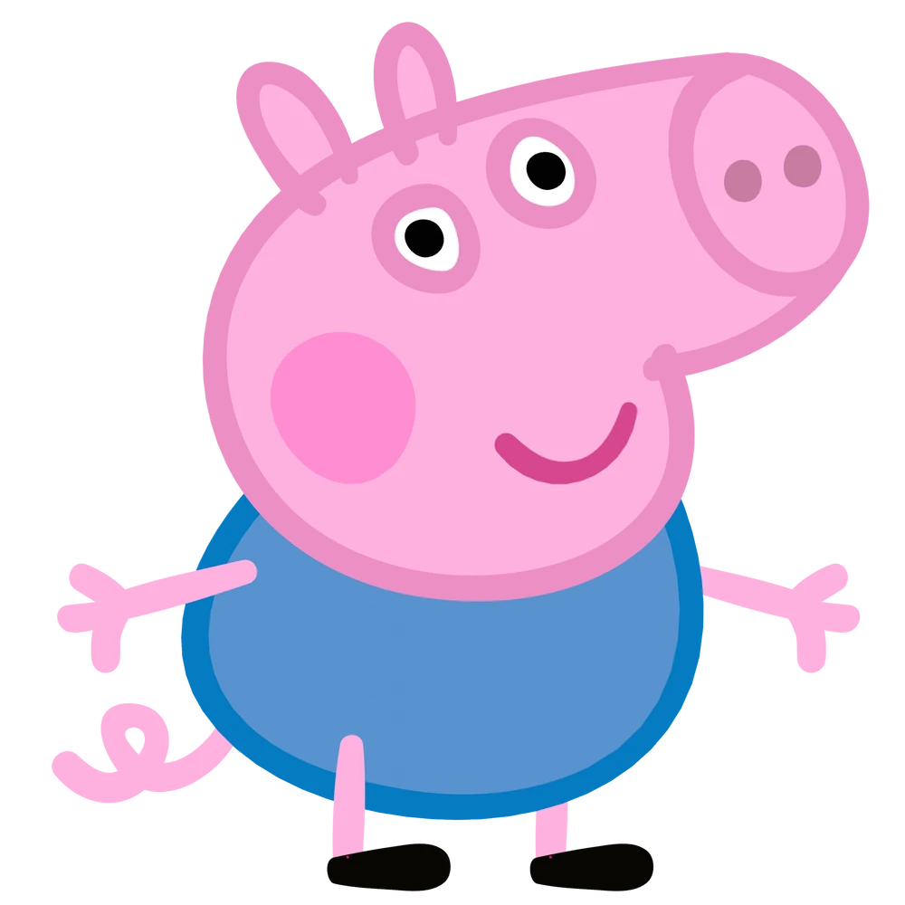

# ML_MINI_2TEAM
--------
## 💡팀명
#### 2DA
"우리는 데이터를 분석하는 데서 멈추지 않고, 인사이트를 통해 행동으로 옮깁니다."

## ✨팀원 소개

| [최우진](https://github.com/CHUH00) | [조세희](https://github.com/SEHEE-8546) | [정의중](https://github.com/uii42) | [박민정](https://github.com/minjeon) | [맹지수](https://github.com/happyfrogg) |
|-------|-------|-------|-------|-------|
|  |  |  |  |  |

--------

## <프로젝트 개요>
### 🌟프로젝트명
여러 요인에 따른 오이와 시금치의 가격 예측
### 📌프로젝트 소개

