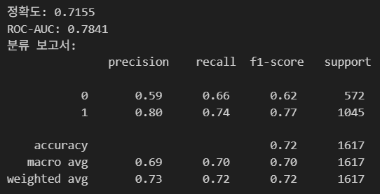
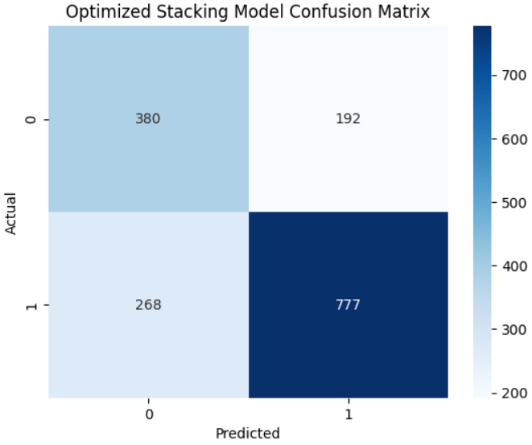

# ML_MINI_2TEAM
--------
## 💡팀명
#### 2DA
"우리는 데이터를 분석하는 데서 멈추지 않고, 인사이트를 통해 행동으로 옮깁니다."

## ✨팀원 소개

| [최우진](https://github.com/CHUH00) | [조세희](https://github.com/SEHEE-8546) | [정의중](https://github.com/uii42) | [박민정](https://github.com/minjeon) | [맹지수](https://github.com/happyfrogg) |
|-------|-------|-------|-------|-------|
|  |  |  |  |  |

--------

## <프로젝트 개요>
### 🌟프로젝트명
UFC 선수의 승리 할 확률 예측
### 📌프로젝트 소개
UFC경기 두 선수의 승, 패, 무승부, 키, 몸무게, 리치, 타격 정확도, 타격 방어율등의 여러 스탯 차이를 계산한 특성들을 통한 
정보를 바탕으로 승리할 확률을 예측하는 프로젝트입니다. 

### 🪟프로젝트 필요성
**1. 베팅 시장 성장**  
   
   특히 모바일 및 온라인 플랫폼의 기술 발전으로 인해 베팅에 대한 접근성이 높아지고 편리해졌습니다.스포츠의 인기가 높아지고 전 세계적으로 스포츠 애호가의 수가 늘어나면서 시장 성장이 더욱 가속화되고 있습니다. 또한 베팅 회사와 스포츠 리그 또는 팀 간의 전략적 파트너십을 통해 시장 가시성과 신뢰성이 향상됩니다. UFC는 전 세계적으로 엄청난 인기를 끌고 있는 스포츠로, 팬들은 항상 경기의 결과를 예측하고 토론하는 것을 즐깁니다. 데이터 기반의 정량적인 분석을 통해 승률을 예측하는 모델을 구축한다면, 팬들에게는 더 큰 재미와 깊이 있는 정보를 제공하고, 관련 산업(미디어, 이벤트, 인기선수 승률 예측을 통한 흥행 예측 등)에는 새로운 분석 관점을 제시할 수 있을 것입니다.
   
  
**2. 숨겨진 승패 결정 요인 발굴 및 예측 정확도 향상**  
   
   '이변'의 발생은 리치 외에 간과되었던 다른 중요한 요인들(예: 경기 스타일 상성, 타격 정확도, 테이크다운 방어율 등)이 승률에 큰 영향을 미칠 수 있음을 시사합니다. 본 프로젝트는 이러한 숨겨진 승패 결정 요인들을 데이터 기반으로 발굴하고, 이를 예측 모델에 통합함으로써 기존의 직관적인 예측보다 훨씬 더 정확하고 신뢰할 수 있는 승률 예측을 가능하게 합니다.
   
--------

## <기술 스택>
      

---------

## <사용한 데이터셋 및 데이터 전처리>
### 1. 사용한 데이터셋
- **데이터명** : UFC DATASETS  

- **데이터 출처** : https://www.kaggle.com/datasets/neelagiriaditya/ufc-datasets-1994-2025/data

### 2. 데이터 전처리
- **결측치 처리** :
  
  - 무승부 결측치 제거: 경기 결과를 파악하는데 도움이 안됨
  - 생년월일, 키, 몸무게의 결측치 제거 -> 선수간의 차이를 계산할수 없고, NULL값이 많지 않음
  - reach 결측치 키 값으로 대체 -> reach 값은 승부에도 중요한 컬럼 값이고, NULL값이 많아 제거불가 또, 키와 상관관계가 매우 큼
  
    

- **나이 변환** :
   - 생년월일을 나이값으로 변환 -> 생년월일로는 선수간의 차이를 계산하기 어려움  
   
     

- **새로운 특성 생성** :
  - 선수 간의 특성 차이 생성  
  
    

  - BMI, 총 경기 수, 공격 점수, 방어 점수, 순공격 이득, 공격/방어 스코어 비율, 타격 효율 차이를 파생 변수로 생성  
  
    

  - 특성 한글 명  
    

--------

## <EDA(탐색적 데이터 분석)>
**1. Features 간의 상관관계 그래프**  

- 차이 특성을 계산할 때 레드팀 선수의 스탯 - 블루팀 선수의 스탯으로 계산을 했기 때문에 유리한 스탯일 수록 높은 상관관계를 보임
- 레드팀 선수의 나이가 많을수록 패배에 뚜렷하게 관여하는 모습

**2. 주요 스탯차이 특성 분포** 

- 주로 정규분포의 형태를 가지고 있음
- 같은 체급의 선수들 끼리 싸우기 때문에 몸무게 차이 특성은 0값 분포가 큼

**2. 주요 스탯차이 특성 분포** 

--------
<h2> <모델 선정 과정> </h2>

<h3>1. Logistic Regression</h3>

  

 - 피드백 : 복잡한 비선형 관계를 반영하기에는 한계가 있어, 다른 트리 기반 모델에 비해 상대적으로 낮은 정확도를 보였습니다. 

<h3>2. Random Forest Classifier</h3>

  

  

 - 피드백 : Logistic보다는 나은 성능을 보였으며, 다양한 피처를 반영했을 때 비교적 안정적인 예측 성능을 보였습니다. 다만 피처 수가 많아 일부 정보가 희석될 가능성이 있습니다. 

<h3>3. XGBoost</h3>

  

 

 - 피드백 : 클래스 불균형을 고려한 하이퍼파라미터 튜닝과 결합해 예측 오차를 줄이는 데 효과적이었습니다. 

 

- 여기까지는 모든 특성을 이용하여 모델을 학습했습니다.
- 하지만 저희 팀의 프로젝트 목표, 프로젝트의 필요성을 다시 생각하게 되어 선수간의 스탯차이로만 학습하고
- 임의의 두 선수가 만났을 때 스탯차이로만 계산하여 승률을 계산하는 것이 더 승률을 예측하는데 도움이 될거라고 생각했습니다.
- 경기 중에 일어난 이벤트 특성들이 많아 예측하는데 많은 도움이 되었지만 전부 드랍하고 다시 모델을 설계했습니다.

--------
## <선정된 모델>  
 ### Stacking (RandomForest, xgboost, lightGBM) 
   
스태킹 모델 내에서 각 모델에 대한 파라미터를 랜덤서치를 사용하여 찾은 최적의 값  
(초기에 파라미터에 대한 기준을 못잡고 여러 배열값을 넣어 학습시간이 오래걸려 랜덤서치로 학습)

--------
## <평가>
##### accuracy : 전체적인 성능, ROC-AUC : 이진 분류의 분리 성능, F1-score : 정밀도와 재현율의 균형  

- 전체 특성 학습 모델  
    
  
- 차이 특성 학습 모델  
    
  선수간의 차이만으로 학습시킨 모델은 전체 특성을 통한 학습보다 성능은 떨어짐. 반면 이진 분리 성능인 F1-score은 유지함

--------
## <평가 성능 향상을 위한 노력>
- RandomizedSearchCV 사용 
  

- 데이터 편향으로 인한 0과 1 클래스의 차이  
  

이를 해결하기 위하여 아래의 차이 특성만으로 학습한 모델에서는 BorderlineSMOTE를 통하여 데이터 편향을 줄이고 학습시켜, 차이를 줄임.  
  

##### 혼동 행렬 시각화  
- 전체 특성 학습 모델 
    
  전체적인 모델 성능은 비슷하지만 0클래스의 예측확률이 떨어지는 모습  
  
- 차이 특성 학습 모델  
    
  BorderlineSMOTE를 통하여 학습 후 차이 특성만 사용하였음에도 소수 클래스인 0의 예측 확률이 상당히 증가  

## <최종 예측>  
    
  
  - 임의의 두 선수를 넣어 승률을 예측함. (승률 예측 함수는 ufc_stacking_prediction_final.ipynb에서 확인 가능)
--------
## <한 줄 회고록>

🐷우진 : 이번 프로젝트를 통해 데이터 분석에서 피처 엔지니어링의 중요성을 절실히 깨달았습니다. 초기에는 정제된 데이터를 활용하여 모델링을 시도했지만, 피처들 간의 명확한 상관관계가 부족해 모델 성능이 기대에 미치지 못했습니다. 성능 향상을 위해 StandardScaler나 PCA와 같은 차원 축소 기법을 적용했음에도 한계를 느꼈습니다. 이후 팀원들과 논의하여 기존 피처를 조합해 새로운 특성을 만드는 피처 엔지니어링에 집중했고, 이는 놀라운 성능 향상으로 이어져 프로젝트를 성공적으로 마무리할 수 있었습니다. 데이터의 숨겨진 가치를 발굴하는 것이 얼마나 중요한지, 그리고 어떤 모델과 하이퍼파라미터 설정을 선택하는지에 따라 결과가 크게 달라질 수 있다는 점을 깊이 배울 수 있었던 소중한 경험이었습니다. 
🐷지수 : 주제 선정과 모델링 가능 여부를 판단하는 데 시간이 많이 들어, 기획 단계의 중요성을 다시 한번 느꼈습니다. EDA에서는 뚜렷한 상관관계가 잘 보이지 않아서 걱정도 있었지만, 모델을 돌려보면서 예상치 못한 피처들이 중요한 역할을 할 수 있다는 걸 알게 되어 흥미로웠습니다. 팀원들과 다양한 모델을 비교하고 실험하는 과정을 통해 실제 모델링에 대한 이해도를 높일 수 있었습니다. 
🐷민정 : 프로젝트 기간 중에 주제 개요 및 선정 시간이 가장 오래 걸리고 그만큼 중요하다는 것을 다시 한 번 체감할 수 있었습니다. 주제에 대해 여러 방면으로 이 프로젝트에 이 주제가 적합한가, 왜 이 프로젝트가 필요한가 등과 관련하여 주제 적합성을 검토하는 과정이 특히 중요하다고 느꼈습니다. 또한, 컬럼이 워낙 많았어서 라벨 데이터와 관련이 높은 피처 값을 판단해 의미 없는 컬럼은 제거하고 중요한 컬럼은 결측치를 의미 있는 방식으로 대체하는 것이 모델 성능에 영향을 끼친다는 것을 배웠습니다. 성능이 좋은 모델을 선택하기 위해 어떤 지표로 성능을 평가할 것인지, 어떤 모델을 사용해볼 것인지 고민해볼 수 있는 시간이었습니다.  
🐷세희 : 데이터 선정과 모델 선정이 모델 성능에 얼마나 많은 영향을 끼치는지 모델이 이 데이터를 잘 이해하게 하려면 어떤 데이터를 가지고 어떻게 학습을 시켜야하는지 너무 많은 것을 배운 프로젝트가 되었다. 원래 가지고 있던 데이터에 있는 특성이 아닌 특성끼리 조합하여 새로운 특성을 생성하고 그 특성을 생성함에 따라 모델에 미치는 성능도 너무나 컸다. 마지막에 프로젝트의 의미를 되찾고자 특성을 전부 바꾸며 모델을 다시 설계하고 실제 데이터를 넣어 예측을 진행하며 내가 설계한 모델로 이렇게 직접 예측까지 진행하니 너무 재밌었다. 팀원들과 함께하지 않았다면 못했을 것이다. 
🐷의중 : 이번 프로젝트에서 주제 선정과 모델 학습을 맡았습니다. UFC 데이터를 분석하며 파생 변수를 생성하고, 다양한 모델을 비교해 최적의 성능을 찾는 과정에서 피처의 중요성을 크게 실감했습니다. 처음엔 주제 적합성에 대해 간과했지만, 데이터를 다루며 문제 정의와 주제 선정이 모델 성능에 미치는 영향을 다시 생각하게 되었습니다. 
